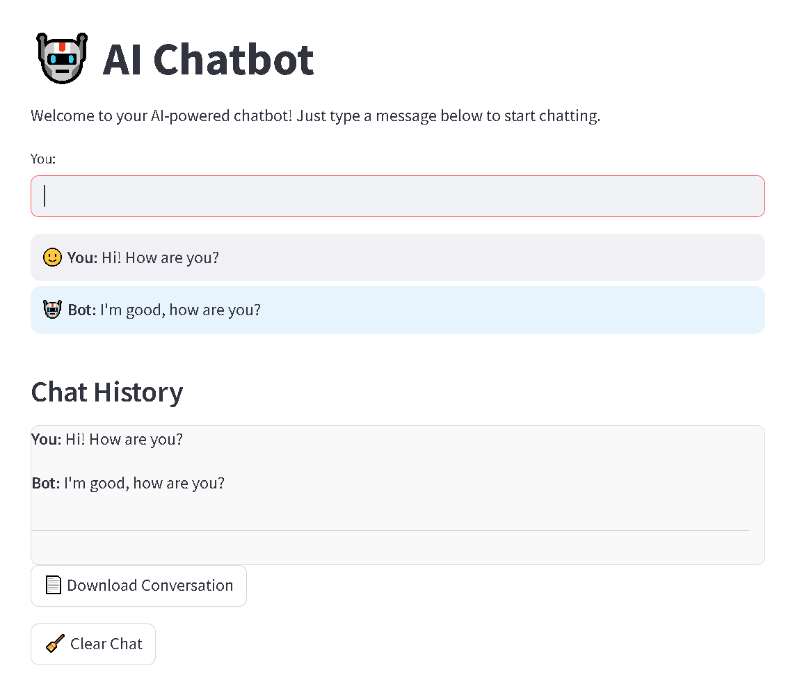

# 🤖 AI Chatbot

Welcome to your personal AI-powered chatbot, built using **DialoGPT** and **Streamlit**!  
This conversational app can chat about anything and even answer basic real-world questions like the current date or time.

---

### 🤖 Demo



---

### 🧠 Features

- 💬 Chat with an AI powered by DialoGPT
- 📅 Handles real-world questions (e.g. “What day is today?” or “What time is it?”)
- 🪄 Stylish chat history with emojis and formatting
- 📄 Download your full chat conversation
- 🧹 Clear chat history with a single click
- 💾 Auto-saves chat to a file (`chat_history.json`)

---

### 🛠️ How It Works

- **Backend**: Uses [DialoGPT-medium](https://huggingface.co/microsoft/DialoGPT-medium) from Hugging Face 🤗
- **Frontend**: Built with [Streamlit](https://streamlit.io/)
- **Chat Memory**: Tracks and stores conversation history with contextual replies

---

### 📦 Installation

1. Clone the repository:

```bash
git clone https://github.com/your-username/ai-chatbot.git
cd ai-chatbot
```

2. Create a virtual environment and install dependencies:

```bash
python -m venv ai-chatbot-env
source ai-chatbot-env/bin/activate  # or .\ai-chatbot-env\Scripts\activate on Windows
pip install -r requirements.txt
```

3. Run the app:

```bash
streamlit run app.py
```

---

## 📁 File Structure

```bash
📦 ai-chatbot/
├── app.py                # Main Streamlit app
├── chatbot_logic.py      # Bot logic using DialoGPT
├── chat_history.json     # Saved chat history
├── requirements.txt
└── README.md
```

---

## 🧠 Future Ideas
- 🔧 Add smarter grounding or fine-tune responses

- 🧑‍🎨 Customize the UI with avatars or themes

- 🧠 Switch to larger language models like GPT-J or GPT-Neo